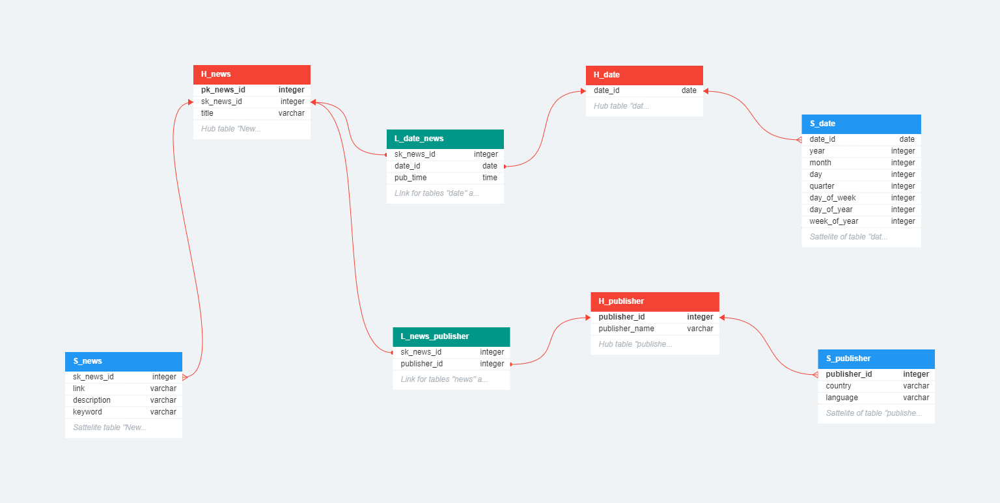
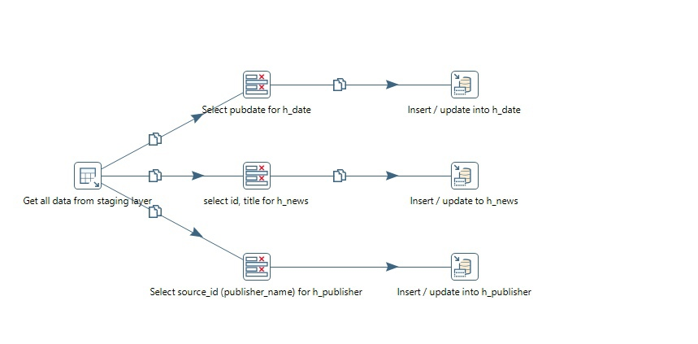
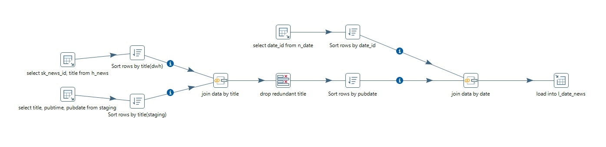

# News DWH with Data Vault

Simple DWH for news content using Data Vault modelling

# Technologies

- Python 3.10
- PostgreSQL 15
- Pentaho DI 9.3

# General Info
This project creates a data repository for news content using tools such as 
- API Reference. The API of [NEWSDATA.IO](https://newsdata.io) is used as a data source. You need to register to access their API.
- PostgreSQL. [ElephantSQL](https://www.elephantsql.com) service will be used as the cloud storage, which provides 20 MB per server for our needs. In total there will be two servers, one (staging) takes the content from the source, the second (DWH) lays out the data in tables according to the rules of Data Vault.
- Python. Using [psycopg2](https://www.psycopg.org) library we will retrieve data via API and upload new data to staging server.
- Pentaho DI.  [This ETL tool](https://sourceforge.net/projects/pentaho/) will help to load our data vault.

**Important note:** the api key and access to the two ElephantSQL servers are not hidden to keep the project open. It is also worth mentioning that the servers provided by ElephantSQL service are unstable and may take some time to continue to work with them.

Now we can look at each item in more detail.
## API Reference

#### Sample API-request

```
  https://newsdata.io/api/1/news?country=us&category=science&apikey=pub_23940db00d0c79dab836398603f98450d0c07
```

| Parameter | Description                    |
| :-------- | :------------------------------|
| `country` | `Select country to get news`   |
| `category`| `Select category of news`      |
| `apikey`  | `Unique key for access to data`|


Consider the structure of the api query result
We get the json format, which consists of the following keys, useful for us:
- status - news loading status (usually "success")
- results is a list of news packed in dictionaries
Which keys are included in news?

| Key       | Description                       |
| :-------- | :-------------------------------- |
|title      | title of the news item            |
|link       | the link to the news              |                                
|keywords   |news keywords                      |
|creator    |author of the news                 |
|video_url  |link to the video content of the news|
|description|description of the news            |
|content    |content of the news                |
|pubDate    | date and time of news publication |
|image_url  | link to the news picture          |
|source_id  |publisher of the news              |
|category   |category of news                   |
|country    |the country the news was published for|
|language   |the language in which the news is written|

## PostgreSQL

To staging server you need to run a script to create a News table that will communicate with the API.
For DWH server you need to think about data model according to Data Vault methodology. Here's how it worked out for me:


To deploy such a model in your server, all you need to do is to run the script **create_staging_layer.sql**

## Python

The following logic is devised for this task:

There is a loadtran library, which has functions for cleaning, loading data into the staging server and a template for loading data from the API.

There is a countries library that stores countries as classes, and these countries have methods for loading news by different categories.

And finally there is a main file that uses all of the above to do the work needed.

It is worth noting that when working with Python there is a primitive log file called report.log to be able to monitor the work of the scripts. 

## Pentaho DI

Working with Pentaho DI consists of 7 steps:
1. Loading data for hub tables
  
2. Load data for the news satellite table
  
3. Load data for the publisher satellite table
  
4. Load date satellite table data
  
5. Load data for the news-date link table
  
6. Load data for the news-publisher link table
  

All previous 6 steps were transformations. Combine the 6 transformations into one job.

**Note:** the cycles and short delays between transformations in the job are due to the instability of the servers.

## Features

- Ability to use the idea of a news repository on your own resources 
- Familiarity with the structure of the Data Vault
- Can connect data to BI tools for analytics


## Epilogue

For a quick deployment of DWH, you can download a backup file already with data called **backup_DWH.sql.lzo**

And I would be grateful for any criticism and suggestions about this project. Thanks!

## Feedback

kshabalin11@yandex.ru

https://t.me/eklipsan