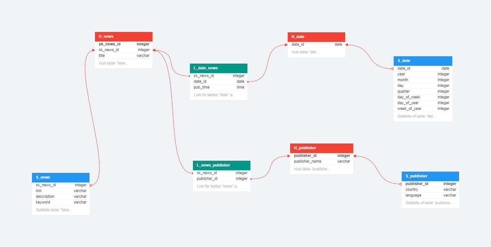
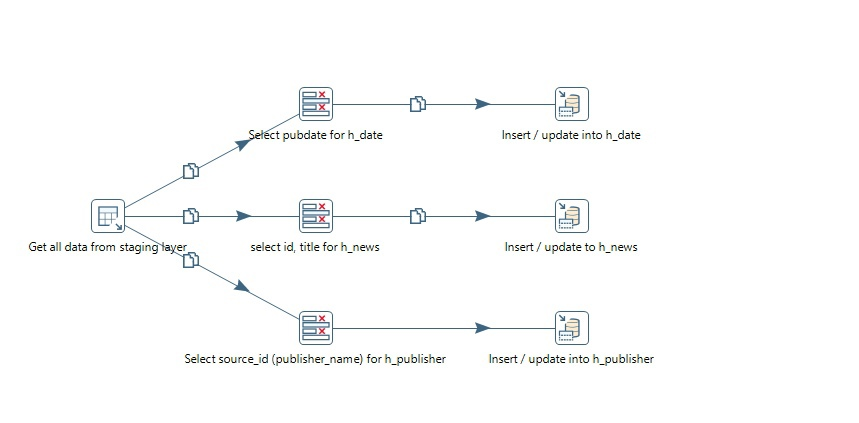
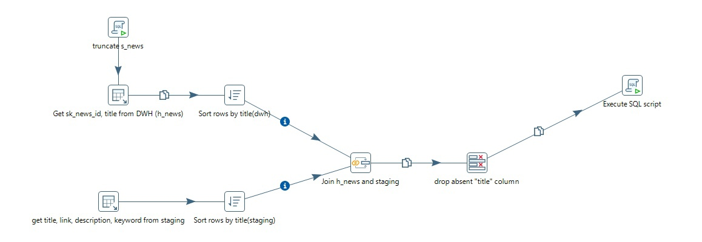
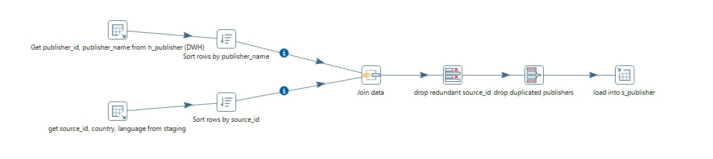
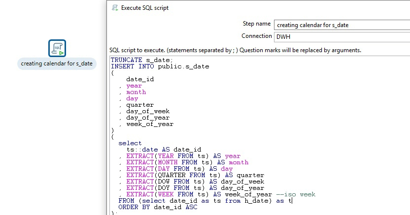
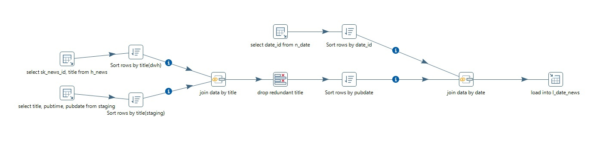
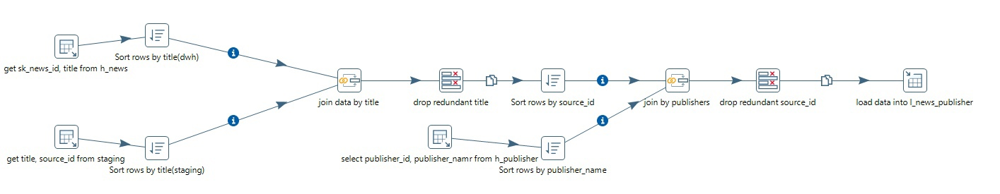
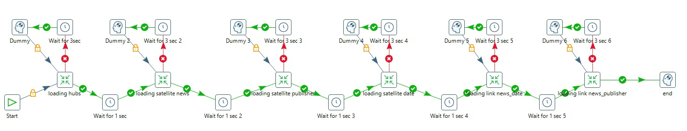

# News DWH с Data Vault

Простой DWH для новостного контента с использованием моделирования Data Vault

# Технологии

- Python 3.10
- PostgreSQL 15
- Pentaho DI 9.3

# Общая информация
Этот проект создает хранилище данных для новостного контента с использованием таких инструментов, как
- API Reference. В качестве источника данных используется API [NEWSDATA.IO](https://newsdata.io). Для доступа к их API необходимо зарегистрироваться.
- PostgreSQL. В качестве облачного хранилища будет использоваться сервис [ElephantSQL](https://www.elephantsql.com), который предоставляет 20 МБ на сервер для наших нужд. Всего будет два сервера, один (staging) забирает контент из источника, второй (DWH) раскладывает данные по таблицам в соответствии с правилами Data Vault.
- Python. Используя библиотеку [psycopg2](https://www.psycopg.org), мы будем получать данные через API и загружать новые данные на staging-сервер.
- Pentaho DI.  [Этот ETL-инструмент](https://sourceforge.net/projects/pentaho/) поможет загрузить наши данные в хранилище.

**Важное примечание:** ключ api и доступ к двум серверам ElephantSQL не скрываются, чтобы сохранить проект открытым. Также стоит отметить, что серверы, предоставляемые сервисом ElephantSQL, нестабильны, и для стабильной работы делаются уступки, которые рассказаны ниже.

Теперь мы можем рассмотреть каждый пункт более подробно.
## API Reference

#### Образец API-запроса

```
  https://newsdata.io/api/1/news?country=us&category=science&apikey=pub_23940db00d0c79dab836398603f98450d0c07
```

| Параметр | Описание |
| :-------- | :------------------------------|
| `country` | `Выберите страну для получения новостей` |
| `category`| `Выбор категории новостей` |
| `apikey` | `Уникальный ключ для доступа к данным`|


Рассмотрим структуру результата api запроса
Мы получаем формат json, который состоит из следующих полезных для нас ключей:
- status - статус загрузки новости (обычно "success")
- results - список новостей, упакованных в словари.
Какие ключи включены в новости?

| Ключ | Описание |
| :-------- | :-------------------------------- |
|title | заголовок новости |
|link | ссылка на новость |
|keywords | ключевые слова новости |
|creator |автор новости |
|video_url | ссылка на видеоконтент новости|
|description|description |description of the news |
|content | содержание новости |
|pubDate | дата и время публикации новости |
|image_url | ссылка на изображение новости |
|source_id |издатель новости |
|category |категория новости |
|country |страна, для которой была опубликована новость|
|language |язык, на котором написана новость|

## PostgreSQL

Для сервера staging необходимо запустить скрипт для создания таблицы News, которая будет взаимодействовать с API.
Для DWH-сервера необходимо продумать модель данных в соответствии с методологией Data Vault. Вот как это получилось у меня:


Чтобы развернуть такую модель на вашем сервере, достаточно запустить скрипт **create_staging_layer.sql**

## Python

Для решения этой задачи разработана следующая логика:

Имеется библиотека loadtran, в которой есть функции для очистки, загрузки данных на staging-сервер и шаблон для загрузки данных из API.

Есть библиотека countries, которая хранит страны как классы, и в этих странах есть методы для загрузки новостей по различным категориям.

И, наконец, есть главный файл, который использует все вышеперечисленное для выполнения необходимой работы.

Стоит отметить, что при работе с Python есть примитивный лог-файл report.log, чтобы можно было следить за работой скриптов.

## Pentaho DI

Работа с Pentaho DI состоит из 7 шагов:
1. Загрузка данных для таблиц-концентраторов
  
2. Загрузка данных для таблицы сателлитов новостей
  
3. Загрузите данные для таблицы сателлитов издателей
  
4. Загрузите данные таблицы сателлитов даты
  
5. Загрузите данные для таблицы ссылок "новости-даты
  
6. Загрузка данных для таблицы ссылок на издателя новостей
  

Все предыдущие 6 шагов были преобразованиями. Объединяем 6 преобразований в одну работу.

**Примечание:** циклы и короткие задержки между преобразованиями в задании связаны с нестабильностью серверов.

## Особенности

- Возможность использовать идею хранилища новостей на собственных ресурсах
- Знакомство со структурой хранилища данных
- Возможность подключения данных к BI-инструментам для аналитики


## Эпилог

Для быстрого развертывания DWH вы можете скачать файл резервной копии уже с данными под названием **backup_DWH.sql.lzo**.

Буду благодарен за любую критику и предложения по этому проекту. Спасибо!

## Обратная связь

kshabalin11@yandex.ru

https://t.me/eklipsan
